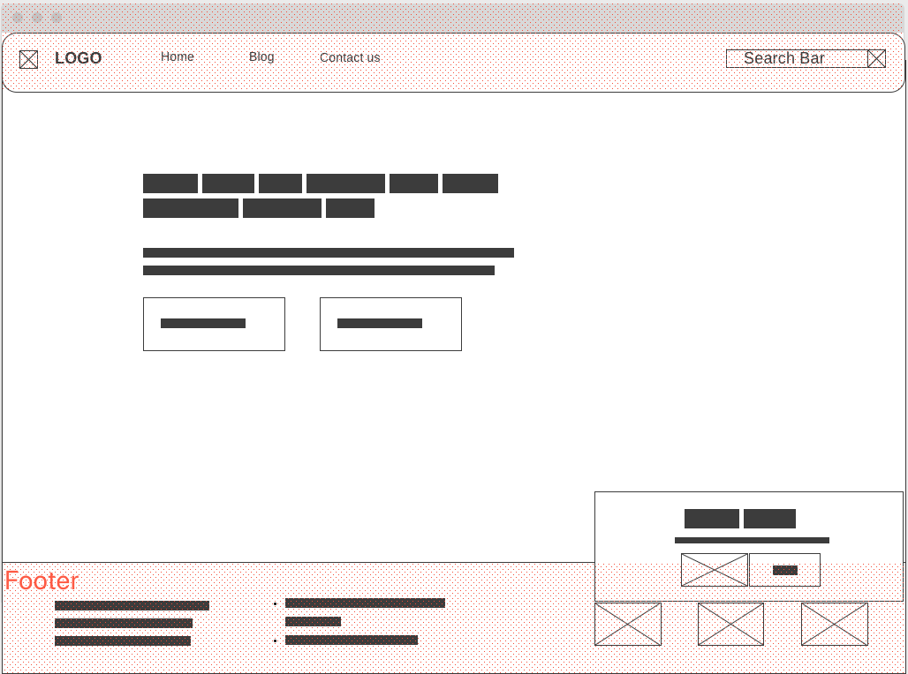
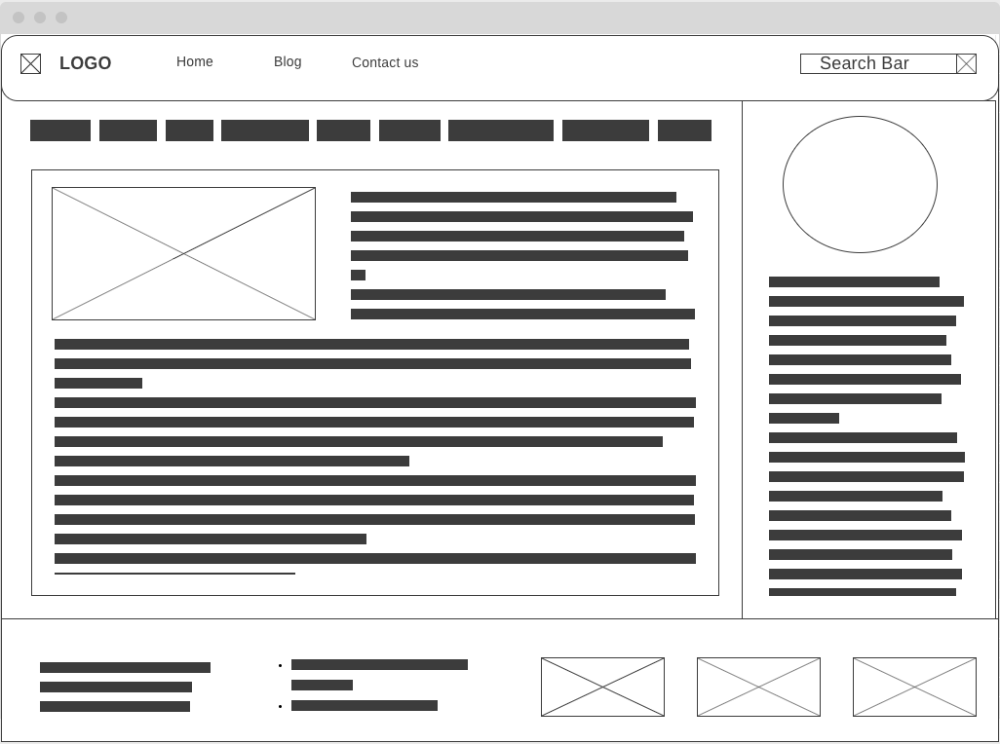
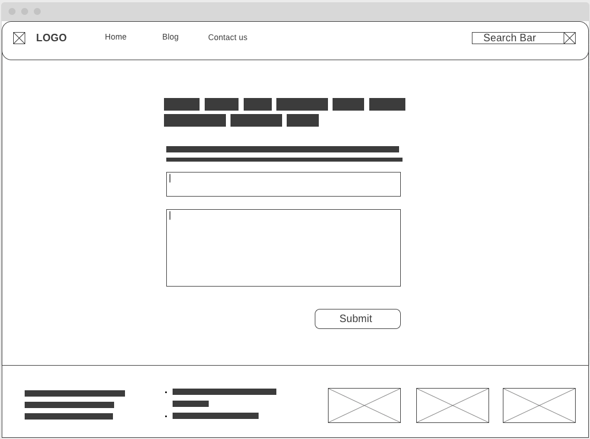
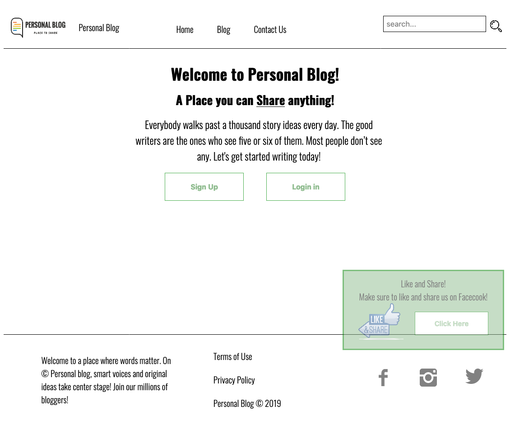
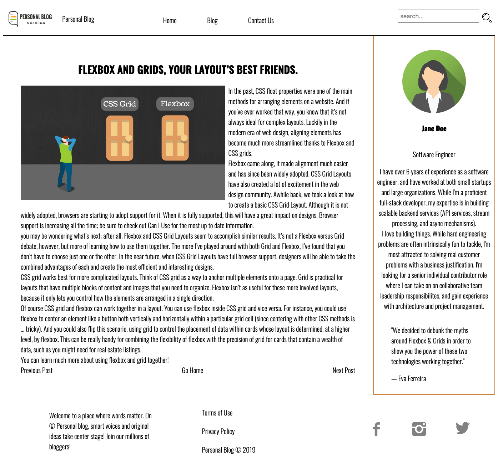
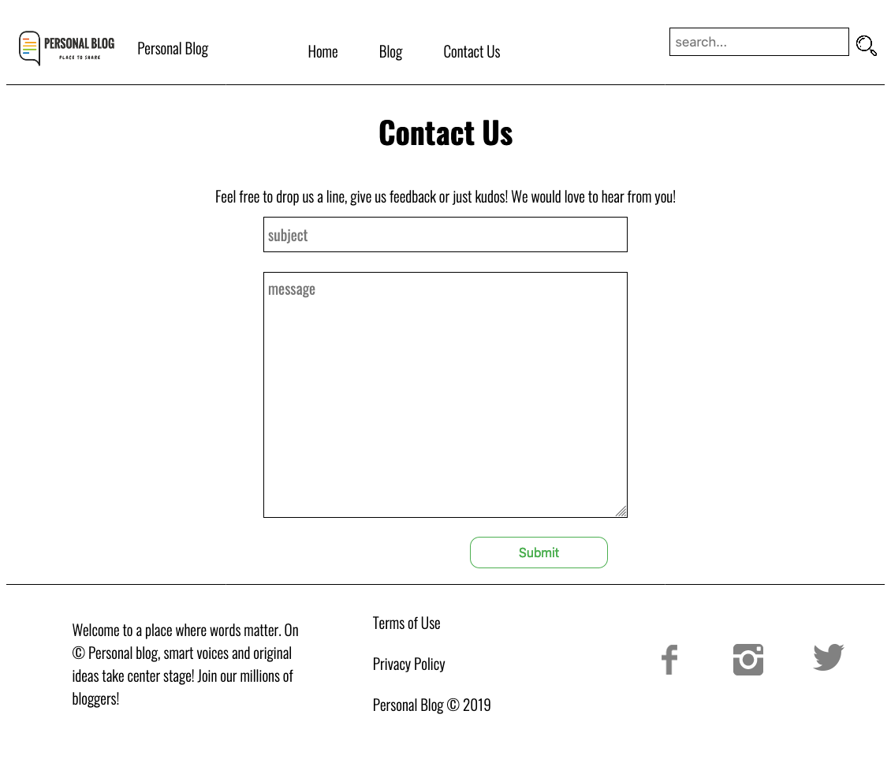
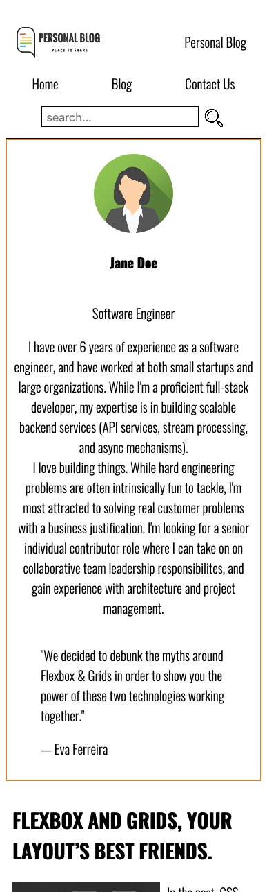
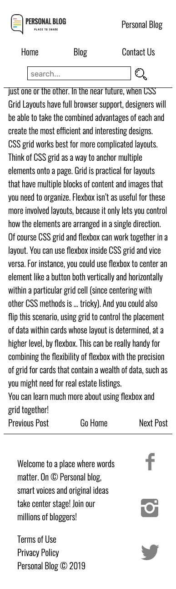

# Personal Blog

#### By Panatda Catlin
###### Initiated December 21th, 2019.

## Description

A static blog webpage. This project will demonstrate how Flexbox works together with CSS grid. Using purely HTML, CSS, CSS Grid, and Flexbox. Design process includes HTML Responsive Web Design, Moblie First Design, prototyping and mockups.

## Mock-Up Samples

<table>
  <tr>
    <td>[Landing page](https://wireframe.cc/EUk5J5).</td>
    <td>[Blog Page](https://wireframe.cc/KkoBmv).</td>
    <td>[Contact Us Form
](https://wireframe.cc/LXNvXh).</td>
  </tr>
</table>

## Project Screenshoot Samples
 
* Deskstop View

<table>
  <tr>
    <td></td>
    <td></td>
    <td></td>
  </tr>
</table>

* Mobile View

<table>
  <tr>
    <td></td>
    <td></td>
    <td></td>
    <td></td>
  </tr>
</table>

## Prerequisites & Installation

None.

## Live demo

* To visit the project [Click Here](https://panatdacatlin.github.io/personal-blog/). This should redirect to `https://panatdacatlin.github.io/personal-blog/`

## Download Repo

* Clone this repository: in the command-line enter:`$ git clone https://github.com/PanatdaCatlin/personal-blog`.


## Usage

To open locally once project is cloned:
1. Navigate to the application directory: `$ cd personal-blog`
2. Execute the command `$ open index.html` or `$ <your browser> index.html`
3. The application will be opened in your browser


## Technologies Used

```
* HTML 5
* CSS
* CSS Grid
* Flexbox
```


## Contributing
Pull requests are welcome. For major changes, please open an issue first to discuss what you would like to change.

Please make sure to update tests as appropriate.

## License
[MIT](https://choosealicense.com/licenses/mit/)